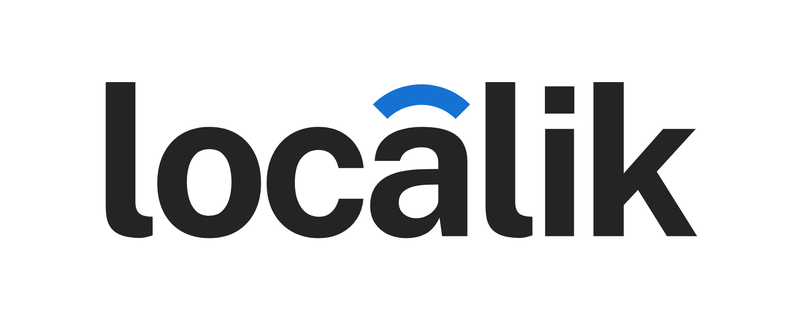

<p align="center">
  
</p>

<h1 align="center">Localik - Car Rental Platform</h1>

<p align="center">
  <strong>A premium, modern car rental web application designed and built for the Moroccan market (based in Casablanca).</strong>
</p>

---

## 🚗 About the Project

**Localik** is a state-of-the-art car rental landing page and web application. It provides users with a seamless, intuitive interface to search for, explore, and book vehicle rentals across major Moroccan cities. 

Designed with rich aesthetics, smooth micro-animations, and responsiveness in mind, the platform aims to provide a luxury-grade user experience for both local and international clients searching for vehicle rentals in Morocco.

### 📍 Project Location & Target Area
The project is tailored for **Morocco**, with its primary business operations and interactive map centered in the economic capital, **Casablanca**. The search widget supports location pick-ups in major Moroccan hubs including:
* Casablanca
* Marrakech
* Rabat
* Tangier
* Agadir
* Fes, Meknes, Oujda, Essaouira, and more.

---

## ✨ Features

- 🔍 **Interactive Search Widget**: A custom location auto-suggest search bar prepopulated with major Moroccan cities.
- 📅 **Hotel-Style Datepicker**: A custom date range selection popover with responsive month views (single month on mobile, dual month on desktop).
- 🚗 **Premium Fleet Showcase**: Beautifully styled car cards displaying key specifications (transmission, seats, fuel type, average reviews, daily rate) with active hover scaling.
- 🗺️ **Integrated Location Section**: Responsive Google Maps integration displaying the physical location in Casablanca, Morocco.
- 💬 **WhatsApp Quick Connect**: A sticky floating WhatsApp widget for instant, real-time client support and booking inquiries.
- 📱 **Fully Responsive Layout**: Built with a mobile-first design principle, adapting smoothly across devices from mobile screens to large desktop monitors.
- ⚡ **Rich Micro-animations**: Integrated GSAP (GreenSock Animation Platform) and custom tailwind transitions to give elements a modern, premium feel.

---

## 🛠️ Technology Stack

- **Framework**: [Next.js](https://nextjs.org/) (App Router)
- **Language**: [TypeScript](https://www.typescriptlang.org/)
- **Styling**: [Tailwind CSS v4](https://tailwindcss.com/)
- **Animations**: [GSAP](https://gsap.com/) & [@gsap/react](https://github.com/greensock/react)
- **Icons**: [Lucide React](https://lucide.dev/)
- **Date Management**: [React Datepicker](https://reactdatepicker.com/)

---

## 🚀 Getting Started

First, run the development server:

```bash
npm run dev
# or
yarn dev
# or
pnpm dev
# or
bun dev
```

Open [http://localhost:3000](http://localhost:3000) with your browser to see the result.

---

## 📬 Business Support & Contacts

For business support, custom projects, or collaborative opportunities, feel free to reach out:

* 📧 **Email**: [ayoubameur.tech@gmail.com](mailto:ayoubameur.tech@gmail.com)
* 💼 **LinkedIn**: [linkedin.com/in/ayoub-ameur-772a70362](https://www.linkedin.com/in/ayoub-ameur-772a70362/)

---
<p align="center">Made with ❤️ by Ayoub Ameur</p>
